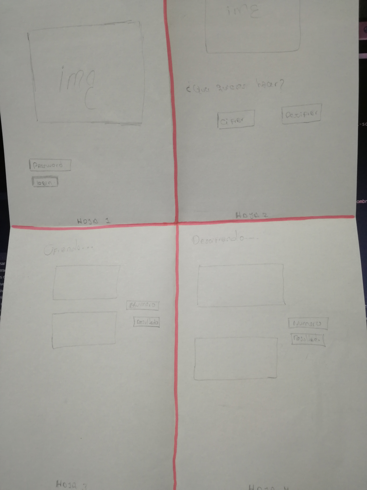
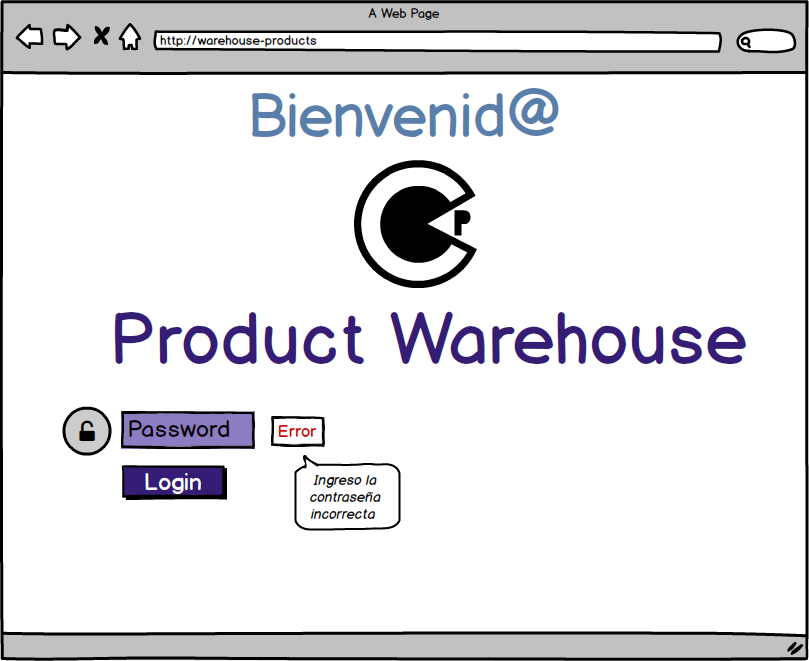
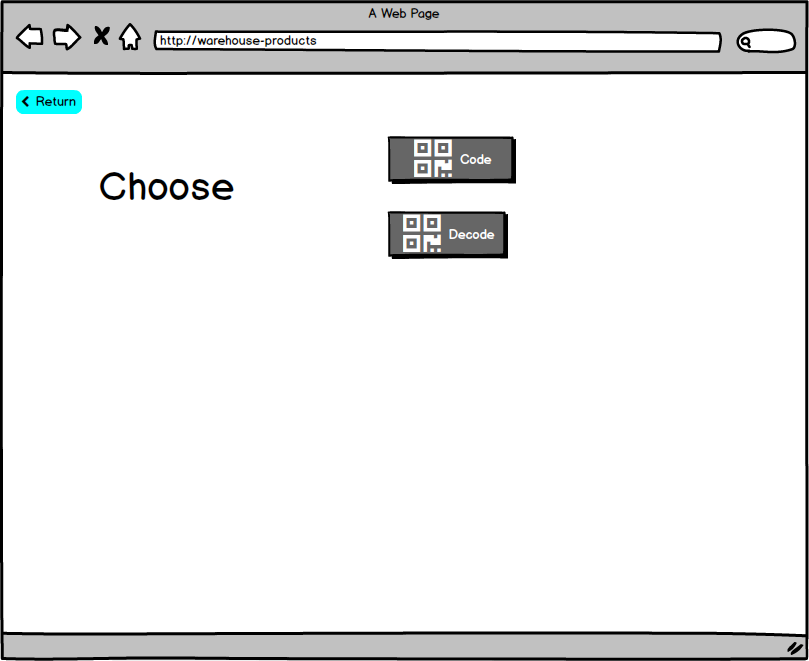
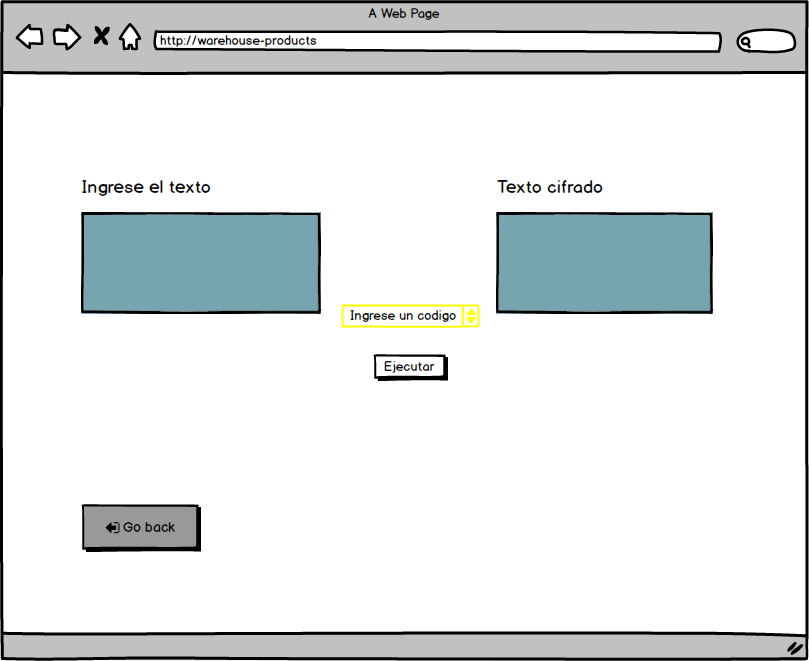
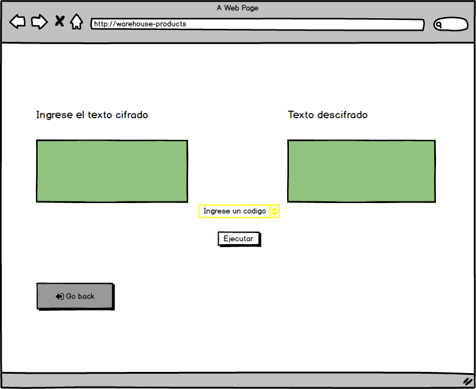

# Warehouse Codes

Warehouse Codes presta servicios a empresas que desean codificar los productos de su almacen, diseñada para integrarse facilmente en cualquier linea de producción.
*Ahorro Comprobado*!

Ofrece soluciones individuales para una amplia gama de aplicaciones e industrias, tales como alimentos, bebidas, cables, alambres, construcción, productos farmacéuticos y cosméticos, así como paquetes secundarios.

## Proceso 
### Prototipo de *baja* fidelidad

En el feedback recibido del prototipo de baja fidelidad se encontro falencias. Como la falta de botones puede generar una dificultad a los usuarios o que tengann una mala experiencia.

### Prototipo de *alta* fidelidad

En este prototipo se trabaja de acuerdo al feedback recibido viendo así como los usuarios se sienten más satisfechos ya que es de su facil comprensión.

